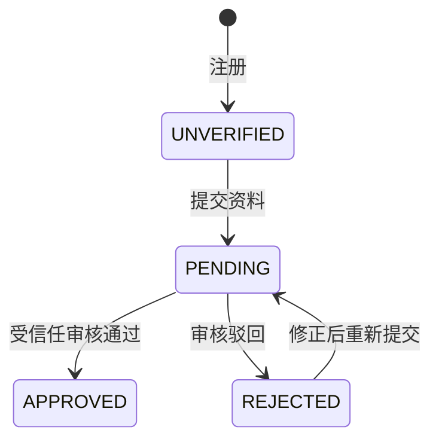

# API v1（当前路径 /api）

统一 JSON 请求。所有修改接口需要请求头 `X-Requested-With: campus-web`，不开放跨域访问。需登录接口使用 `CAMPUS_SESSION` Cookie，前端通过同源代理访问。

错误响应：`{"message":"错误说明"}`，HTTP 400 输入错误、401 未登录/密码错误、403 身份或权限不足、404 资源不存在、409 重复或状态冲突、429 频率限制、503 服务未配置或不可用。

| 方法 | 路径 | 说明 |
| --- | --- | --- |
| GET | `/config` | 开发环境标识、审核服务接入状态 |
| POST | `/auth/code` | `{role, phone}` 发送验证码，仅 dev 返回 debugCode |
| POST | `/auth/register` | `{role, phone, code, password}` 注册，账号为手机号 |
| POST | `/auth/login` | `{role, phone, password}` 登录并设置 Cookie |
| POST | `/auth/logout` | 删除当前会话、清除 Cookie |
| GET | `/me` | 当前账号脱敏资料、认证/操作权限、上次登录时间、岗位数量 |
| POST | `/verification` | 按当前会话角色提交资料，不能通过请求修改角色或权限 |
| GET | `/verification/events` | 当前用户审核事件记录 |
| GET | `/jobs` | 发布者查看自己的最新100条岗位，学生查看平台最新100条岗位及自己是否已领取 |
| POST | `/jobs` | 已认证且有权限的发布者：`{title, description, location, pay}`，pay 为整数元/天 |
| POST | `/jobs/{id}/apply` | 已认证且有权限的学生领取岗位，数据库唯一约束防止重复 |
| POST | `/dev/review` | 仅 dev：`{reviewId, approved}` 模拟当前用户审核结果 |

`role` 只能为 `PUBLISHER` 或 `STUDENT`。中国大陆手机号格式为 `1[3-9][0-9]{9}`。密码 8–64 个非空格 ASCII 字符，至少包含一个字母和一个数字。邮箱可选。

发布端认证请求：

```json
{
  "organization": "单位名称",
  "surname": "姓氏",
  "name": "名字",
  "identityNumber": "18位身份证号",
  "email": "contact@example.com"
}
```

领取端认证请求：

```json
{
  "school": "学校名称",
  "name": "完整姓名",
  "studentNumber": "学号",
  "email": "student@example.com"
}
```



提交与审核决定均使用数据库事务和行锁。只有 `APPROVED` 且角色对应权限字段为 1 时可操作岗位。任何前端按钮隐藏/禁用都不作为权限依据。
