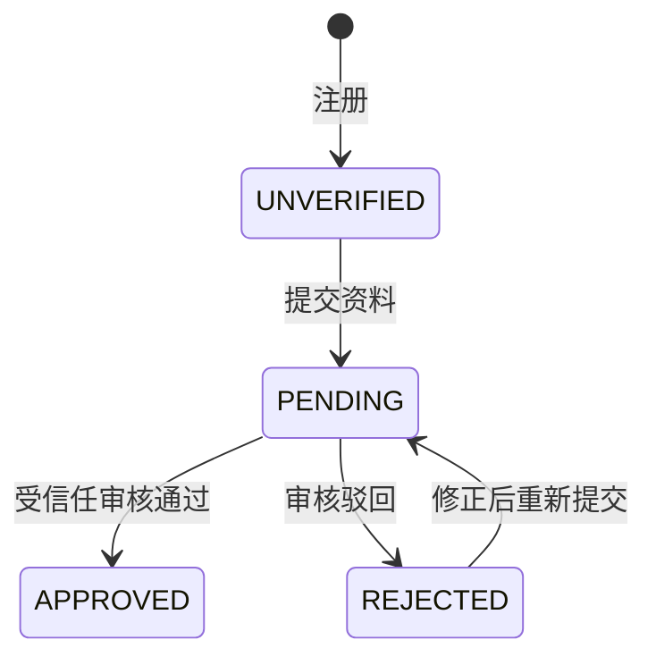

# API v1（当前路径 /api）

统一 JSON 请求。所有修改接口需要请求头 `X-Requested-With: campus-web`，不开放跨域访问。需登录接口使用 `CAMPUS_SESSION` Cookie，前端通过同源代理访问。

错误响应：`{"message":"错误说明"}`，HTTP 400 输入错误、401 未登录/密码错误、403 身份或权限不足、404 资源不存在、409 重复或状态冲突、429 频率限制、503 服务未配置或不可用。

| 方法 | 路径 | 说明 |
| --- | --- | --- |
| GET | `/config` | 开发环境标识、审核服务接入状态 |
| POST | `/auth/code` | `{role, phone}` 发送验证码，仅 dev 返回 debugCode |
| POST | `/auth/register` | `{role, phone, code, password}` 注册，账号为手机号 |
| POST | `/auth/login` | `{role, phone, password}` 登录并设置 Cookie |
| POST | `/auth/logout` | 删除当前会话、清除 Cookie |
| GET | `/me` | 当前账号脱敏资料、认证/操作权限、上次登录时间、岗位数量 |
| POST | `/verification` | 按当前会话角色提交资料，不能通过请求修改角色或权限 |
| GET | `/verification/events` | 当前用户审核事件记录 |
| GET | `/jobs` | 发布者查看自己的最新100条岗位，学生查看平台最新100条岗位及自己是否已领取 |
| GET | `/jobs/{id}` | 岗位详情、剩余名额及接取者公开昵称和头像，不包含学生实名资料 |
| POST | `/jobs` | 已认证且有权限的发布者：`{title, category, requiredCount, description, requirements, location, pay, startsAt, durationMinutes}`，pay 为精确到分的每人每次报酬；详见《兼职岗位与接取名额》 |
| POST | `/jobs/{id}/apply` | 已认证且有权限的学生确认加入岗位；事务锁校验剩余名额、开始时间及重复接取 |
| POST | `/dev/review` | 仅 dev：`{reviewId, approved}` 模拟当前用户审核结果 |

`role` 只能为 `PUBLISHER` 或 `STUDENT`。中国大陆手机号格式为 `1[3-9][0-9]{9}`。密码 8–64 个非空格 ASCII 字符，至少包含一个字母和一个数字。邮箱可选。

发布端认证请求：

```json
{
  "organization": "单位名称",
  "surname": "姓氏",
  "name": "名字",
  "identityNumber": "18位身份证号",
  "email": "contact@example.com"
}
```

领取端认证请求：

```json
{
  "school": "学校名称",
  "name": "完整姓名",
  "studentNumber": "学号",
  "email": "student@example.com"
}
```



提交与审核决定均使用数据库事务和行锁。只有 `APPROVED` 且角色对应权限字段为 1 时可操作岗位。任何前端按钮隐藏/禁用都不作为权限依据。

## 个人资料与主页

| 方法 | 路径 | 说明 |
| --- | --- | --- |
| PUT | `/me/profile` | 当前用户编辑昵称、生日、简介；学生可编辑年级、专业 |
| POST | `/me/avatar` | multipart/form-data，字段 `file`，PNG/JPEG，最大2MB |
| GET | `/users/{id}` | 登录后可查看的主页；不包含生日、手机、邮箱、真实姓名、证件或钱包 |
| GET | `/users/{id}/avatar` | 登录后读取头像，服务端统一转为256×256 PNG并去掉原始元数据 |
| GET | `/me/history?page=0` | 本人的完整发布/接取历史，每页20条，时间倒序 |
| GET | `/jobs/{id}/applicants?page=0` | 仅岗位发布者可查看接取名单，包含主页ID、昵称、头像、真实姓名、学号、学校和结算状态 |

个人资料请求：

```json
{
  "nickname": "贝鱼同学",
  "birthday": "2004-06-15",
  "grade": "大三",
  "major": "计算机科学与技术",
  "bio": "喜欢摄影和活动策划"
}
```

昵称必填，最多40字符；生日可为null，不能晚于今天或早于1900年；简介最多300字符；专业最多100字符。年级可为空或“大一、大二、大三、大四、大五、硕士、博士”。企业不得提交非空年级/专业。生日仅本人可见，学校仅对接取岗位的发布者开放，单位认证通过后公开；不解密实名认证姓名作为公开昵称。

## 模拟钱包与结算

所有余额仅为模拟资金，不代表真实人民币或实际到账。配置 `WALLET_MODE=SIMULATED` 时可操作；设置其他值会关闭资金写入接口。当前没有银行卡绑定、真实充值或支付提供方接口。

| 方法 | 路径 | 说明 |
| --- | --- | --- |
| GET | `/wallet?page=0` | 本人的可用余额、冻结余额、20条流水及最近20条提现申请 |
| POST | `/wallet/top-up` | 企业模拟充值；学生不能调用 |
| POST | `/applications/{applicationId}/payment` | 岗位发布者向该接取学生发放模拟兼职费，每条接取记录仅结算一次 |
| POST | `/wallet/withdrawals` | 学生发起模拟提现，扣减可用余额并冻结等额资金，状态PENDING |
| POST | `/wallet/withdrawals/{id}/cancel` | 本人撤销待处理申请，退回冻结金额，状态CANCELLED |

金额操作请求：

```json
{
  "amount": "150.25",
  "requestKey": "a5ec559f-4c6b-4a92-80df-14e17cfa22bf"
}
```

金额单位为元，范围0.01–100000，最多两位小数。所有数据库金额及响应的 `*_cents` 字段为整数分。撤销请求只需 `requestKey`。一次逻辑操作生成一个UUID，请求超时重试应复用同一UUID；同一UUID更换金额或目标会返回409。

发放在同一事务内执行企业扣款、学生入账、双边流水与结算记录；钱包按用户ID固定顺序加行锁，接取记录有唯一结算约束。余额不足全部回滚；重复请求返回 `replayed=true` 且不重复入账。提现冻结与撤销也记录可用/冻结余额变动及变动后的余额。提现仅进入待处理，不会伪装为银行到账。
